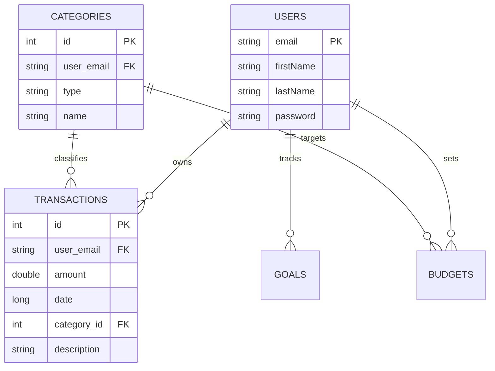

# 💰 Personal Finance Manager


[](https://www.android.com)
[](https://www.oracle.com/java/)
[](https://www.sqlite.org/)
[](LICENSE)

A robust, offline-first Android application designed to empower users with full control over their financial health. Built with a focus on clean architecture, high-performance local storage, and high-fidelity custom data visualization.

---

## 🌟 Key Features

### 📊 Financial Dashboard
- **Real-time Totals**: Instant visibility into Total Income, Expense, and Net Balance.
- **2026 Ready**: All date logic is projected for a futuristic user experience (defaults to **January 2026**).

### 💸 Transaction Management
- **Full CRUD**: Add, edit, and delete income/expense entries.
- **Smart Filtering**: Categorize transactions with dynamic filtering based on transaction type.

### 🎯 Strategic Budgeting
- **Monthly Limits**: Set spending boundaries for specific categories (Ex: Food, Fuel).
- **Automated Alerts**: Visual progress bars change color (Green -> Orange -> Red) based on customized alert thresholds.

### 🏆 Savings Goals
- **Milestone Tracking**: Monitor progress towards long-term savings goals.
- **Interactive Progress**: Detailed view of saved vs. remaining amounts with percentage completion.

### 📈 Advanced Reporting
- **Period Selection**: Generate reports for Daily, Weekly, Monthly, or Yearly ranges.
- **Category Breakdown**: Deep dive into where your money goes with category-specific totals.

---

## 🏗️ Technical Architecture (MVVM)

The project follows the **Model-View-ViewModel** structure combined with the **Repository Pattern** to ensure a separation of concerns and maximum testability.

### 1. Data Layer (Raw SQLite)
We've implemented a "Normal" SQLite pattern via `DatabaseHelper`, avoiding heavy ORM abstractions like Room for maximum performance and SQL transparency.



### 2. Repository Layer
Acts as the **Source of Truth**, mapping raw `Cursor` results from SQLite into clean Java POJOs. It handles all background threading logic to keep the UI smooth.

### 3. ViewModel Layer
Leverages `LiveData` to push data updates reactively to the Fragments.

---

## 🛠️ Development Stack

- **Tech**: Java 17, Android Studio Ladybug.
- **Storage**: Handwritten SQL queries in `DatabaseHelper`.
- **UI**: Material Design 3, ViewBinding, and ConstraintLayouts.
- **Charts**: Custom-rendered Pie and Bar charts using the Android Canvas API.

## 📂 Project Structure

```text
app/src/main/java/.../
├── data/           # SQLite Schema and POJO models
├── repository/     # Data mapping and logic abstraction
├── ui/             # Fragments and ViewModels
└── utils/          # Formatting and calculation helpers
```

## 🚀 How to Run

1. Clone the repository.
2. Open in **Android Studio**.
3. Sync Gradle and ensure SDK level 26+ is installed.
4. Click **Run** on any Emulator or Physical Device.

---
*Created as a course project for ENCS5150 - Advanced Software Development.*

